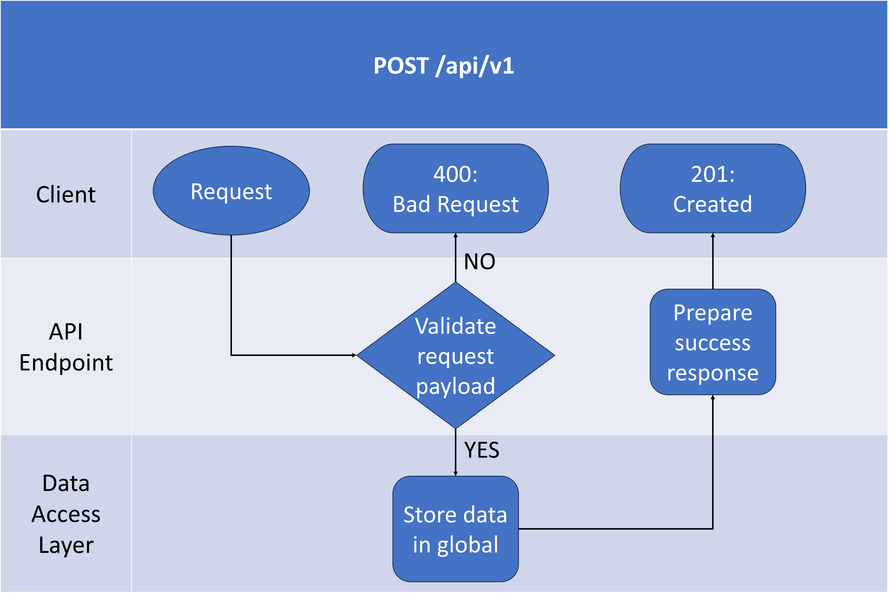
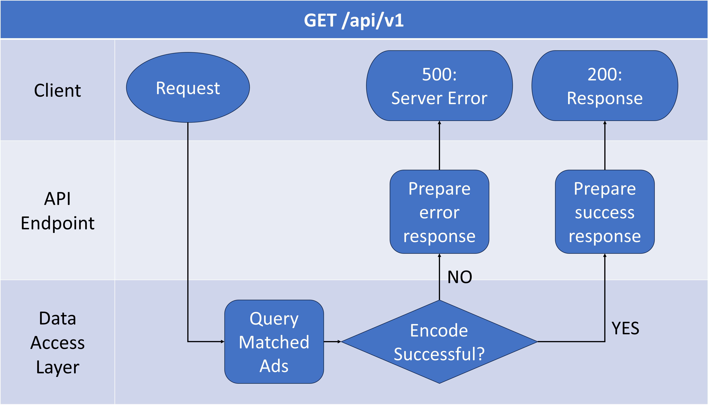

# Golang training

- **Build** the Go file: `go build <filename>.go`
  - Build all files in same package: `go build .`
- Run the Go file: `go run <filename>.go`
  - Run all files in same package: `go run .`
- Run the .exe file: `path/to/your/<filename>`

#### 

- Go mod initial: `go mode init github.com/Ateto1204/<filename>`
- Import gorilla mux: `go get -u github.com/gorilla/mux`

### Work Flow of POST

  

#### Work Flow of GET

  

